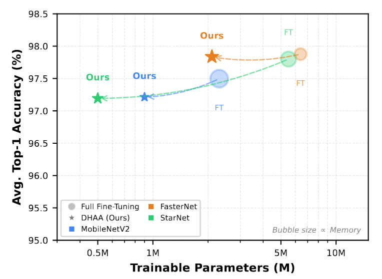
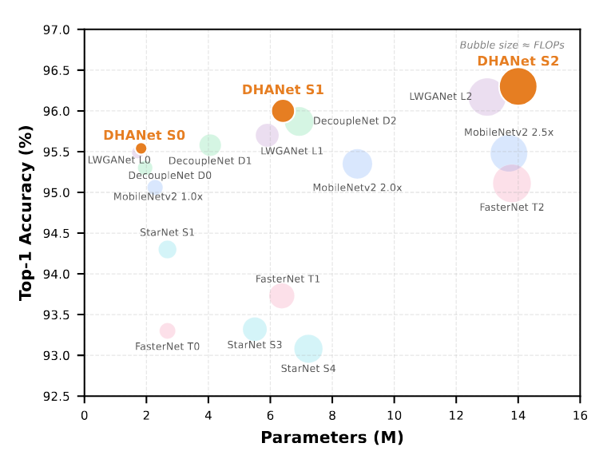

# DHA Adapter for Remote Sensing Scene Classification
We propose the Dynamic Heterogeneous Attention (DHA) Adapter, a novel PEFT framework that adaptively models multi-scale remote sensing features via content-aware dynamic routing. Furthermore, by hierarchically stacking DHA blocks, we develop DHANet, a family of lightweight models that set new state-of-the-art results among networks of similar size.
### 1. Architecture

*Comparison of DHA Adapter with Full Fine-Tuning across multiple backbones and datasets.*

### 2. Experimental Results

*Comparison of Top-1 accuracy vs. parameter count on the NWPU-RESISC45 dataset.*
